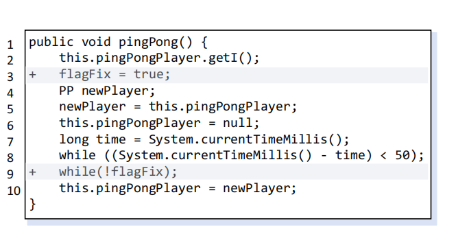

# FIXRW evaluation dataset

This directory contains the public benchmark material used to evaluate FIXRW on existing fixes for concurrency bugs.

## Contents

### `real-world/`

Six real-world Java concurrency-bug cases. Each case contains:

- `original/`: the buggy program version;
- `correct/`: the correct fix;
- `incorrect/`: the incorrect fix;
- `metadata.json`: repository, version labels, and test entry point.

### `llm-generated/`

LLM-generated candidates are separated into `correct/` and `incorrect/`. Every candidate contains:

- `before/`: the input program;
- `after/`: the program after applying the generated patch;
- `metadata.json`: generator and correctness label.

### Why PFix’s PingPong Fix Is Incorrect

PFix attempts to fix the concurrency bug in `pingPong()` as shown above.  
However, this fix remains **incorrect**. Consider the following interleaving:

- Thread $T_1$ executes line 6 (`this.pingPongPlayer = null`) but has not yet reached line 10 (`this.pingPongPlayer = newPlayer`).
- Thread $T_2$ starts executing and calls `pingPong()`. It invokes `this.pingPongPlayer.getI()`, but `pingPongPlayer` is now `null`, resulting in a **NullPointerException**.
## Licensing

Source snapshots retain their upstream license and notice files. No single license is asserted here for all upstream source code. Check the license files in each project before redistribution or reuse.
